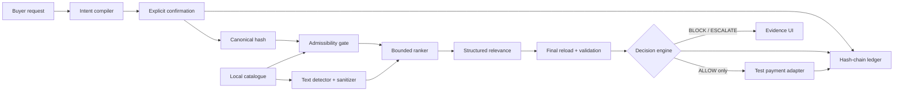

# Architecture

`guard/` owns authorization logic. `payments/` receives a validated decision rather than raw price/SKU input. `audit/` records tamper-evident events. `evaluation/` uses only `FakePaymentSink`.

